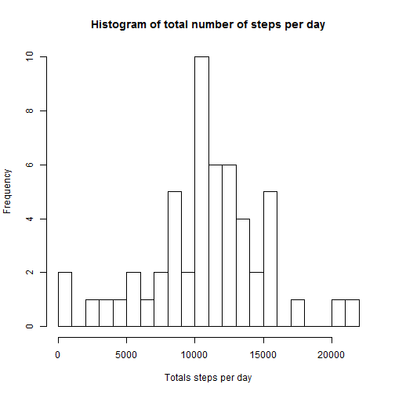
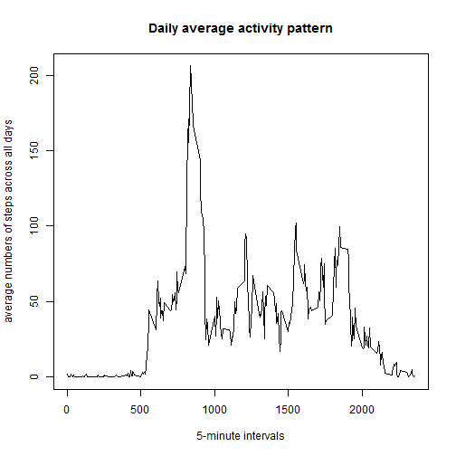
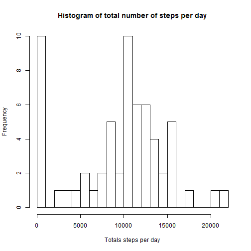
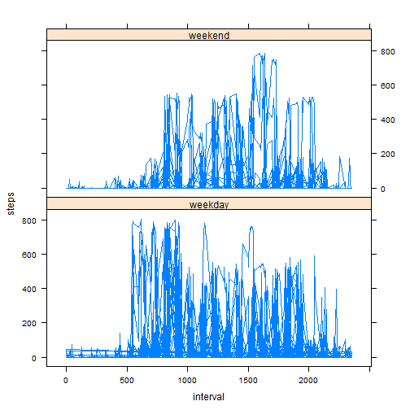

# Reproducible Research: Peer Assessment 1


## Loading and preprocessing the data


```r
activity <- read.csv("activity.csv")
activity$date <- as.Date(activity$date, "%Y-%m-%d")
```

## What is mean total number of steps taken per day?


```r
countSteps <- aggregate(steps ~ date, activity, sum)
hist(countSteps$steps, breaks=20, main = "Histogram of total number of steps per day", xlab = "Totals steps per day")
```

 

#### Mean of steps taken per day : 1.0766 &times; 10<sup>4</sup>

#### Median of steps taken per day : 10765

## What is the average daily activity pattern?


```r
dailyAverage <- aggregate(.~interval, FUN=mean, data=activity)
plot(dailyAverage$interval, dailyAverage$steps, type="l", main="Daily average activity pattern", xlab = "5-minute intervals", ylab = "average numbers of steps across all days")
```

 

#### Interval that contains the maximum number of steps averaged across all days : 835

## Imputing missing values

#### Total number of missing values in the dataset : 2304

#### Missing values for steps is replaced by 0

#### New data set with missing values 0 


```r
missingsteps <- is.na(activity$steps)
activity2 <- activity
activity2[missingsteps, "steps"] <- 0
```

#### Histogram of total steps with replaced dataset


```r
countSteps2 <- aggregate(steps ~ date, activity2, sum)
hist(countSteps2$steps, breaks=20, main = "Histogram of total number of steps per day", xlab = "Totals steps per day")
```

 

#### Mean of steps taken per day : 9354.2295

#### Median of steps taken per day : 1.0395 &times; 10<sup>4</sup>

#### By making the assumption that total steps taken is 0, average and median have reduced values now.

## Are there differences in activity patterns between weekdays and weekends?


```r
weekend <- weekdays(as.Date(activity$date)) %in% c("Saturday", "Sunday")
dateActivity <- transform(activity, weekend=as.POSIXlt(date, format='%Y/%m/%d')$wday %in% c(0, 6))
dateActivity$daytype[weekend==TRUE] <- "weekend"
dateActivity$daytype[weekend==FALSE] <- "weekday"

library(lattice)
xyplot(steps ~ interval | daytype, data = dateActivity, layout = c(1, 2), type = "l")
```

 
